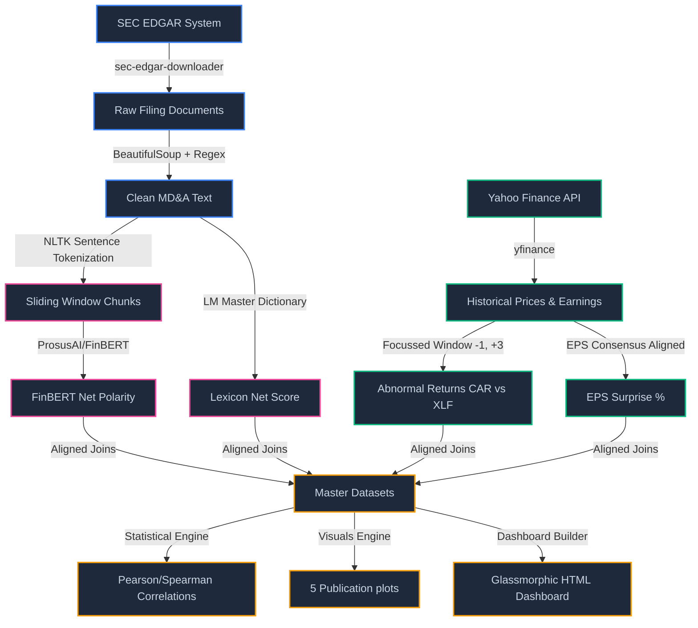
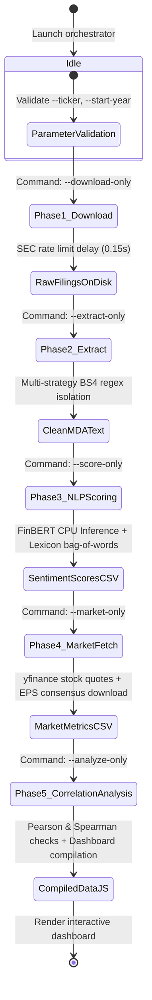
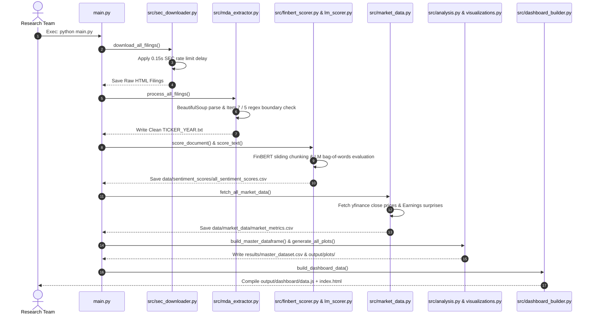

<div align="center">
  
  
  # SEC Earnings Sentiment Analysis Pipeline
  ### 10-K & 20-F Narrative Tracker — Deep Learning (FinBERT) vs. Lexicon Heuristics
  
  [](https://www.python.org/)
  [](https://pytorch.org/)
  [](https://huggingface.co/models)
  [](https://github.com/ranaroussi/yfinance)
  [](LICENSE)
</div>

---

## 📖 Overview
The **SEC Earnings Sentiment Analysis Pipeline** is a professional-grade, multi-phase financial natural language processing (NLP) and quantitative research workbench. It downloads unstructured SEC corporate filings, isolates the highly narrative **Management's Discussion and Analysis (MD&A)** sections, evaluates them using deep learning (FinBERT) and financial lexicon heuristics (Loughran-McDonald), and aligns the resulting narrative signals against real-world market movements (Cumulative Abnormal Returns) and quarterly fundamental outcomes (EPS Surprises).

This pipeline has been run over a comprehensive historical cohort of major global banking institutions—**JPMorgan Chase (JPM)**, **Goldman Sachs (GS)**, **Wells Fargo (WFC)**, **Citigroup (C)**, and **HSBC Holdings (HSBC)**—covering filings submitted from **2021 to 2026** (representing fiscal years 2020–2024).

---

## ✨ Features
- 📥 **SEC EDGAR Compliance**: Secure, rate-limited downloads utilizing official SEC-compliant User-Agent structures.
- 📐 **Narrative Section Isolation**: Beautifully isolates Item 7 (10-K for US entities) and Item 5 (20-F for foreign private issuers like HSBC) using multi-strategy regex boundary matching.
- 🧠 **Context-Aware Deep Learning**: Sentence tokenization and sliding-window chunk processing (≤400 tokens, 1-sentence overlap) evaluating narrative nuance through `ProsusAI/finbert`.
- 🧮 **Lexicon Comparison**: Benchmarks deep-learning scores against the classical Loughran-McDonald lexicon bag-of-words counting engine.
- 📈 **Market Return Alignment**: Pulls stock price data via `yfinance` to compute **Cumulative Abnormal Returns (CAR)** inside a `[-1, +3]` trading-day window centered on the filing date, benchmarked against the Financial Select Sector SPDR Fund (**XLF**).
- 📊 **Earnings Surprise Extraction**: Computes quarterly **EPS Surprises** (`(Actual - Estimated) / |Estimated| * 100`) for fundamental alignment.
- 🎨 **Glassmorphic Interactive Dashboard**: A slate-dark HTML/CSS/JS analytics interface powered by Chart.js and enriched with **LottieFiles** high-performance pipeline animations.

---

## 🏗️ Architecture
The end-to-end data pipelines follow a robust linear progression from ingestion to downstream interactive visual rendering.



---

## 🔄 Pipeline Lifecycle
The pipeline progresses through five distinct execution states, allowing step-by-step resumption and isolated runs:



---

## 🔀 Data Flow Sequence
The orchestrator coordinates the sequence of data retrieval, transformations, scoring, and output generation across all files:



---

## 🚀 Installation & Setup

Ensure you have a modern Python 3.10+ installation. For fast, isolated execution, this project is optimized to run under **uv**, the high-performance Python package installer.

### 1. Clone & Set Up Directory

```bash
git clone <repository-url>
cd bold-franklin
```

### 2. Install Dependencies

You can install dependencies using standard pip:
```bash
pip install -r requirements.txt
```

Alternatively, utilizing **uv** ensures extremely rapid package installs and isolated execution:
```bash
uv pip install -r requirements.txt
```

---

## 📖 Pipeline Usage

The orchestrator `main.py` runs the entire pipeline end-to-end or in separate phases.

### A. Run End-to-End (Full Pipeline)
Downloads filings, extracts MD&A text, runs sentiment analysis, downloads Yahoo stock and EPS metrics, calculates correlations, plots and builds the dashboard:
```bash
python main.py
```

### B. Run Individual Pipeline Phases
Isolate execution to specific segments using CLI switches:

| Phase | Description | Command | Output Artifact |
|---|---|---|---|
| **Phase 1** | Download raw SEC filings | `python main.py --download-only` | `data/filings/` |
| **Phase 2** | Extract & clean narrative MD&A | `python main.py --extract-only` | `data/mda_texts/` |
| **Phase 3** | Execute sentiment scoring | `python main.py --score-only` | `data/sentiment_scores/all_sentiment_scores.csv` |
| **Phase 4** | Fetch price data & calculate CAR | `python main.py --market-only` | `data/market_data/market_metrics.csv` |
| **Phase 5** | Analyze correlations & render | `python main.py --analyze-only` | `output/results/` & `output/plots/` |

### C. Target Specific Companies
Run the pipeline for a single corporate ticker (e.g. Wells Fargo):
```bash
python main.py --ticker WFC
```

---

## 🛠️ Reusable Science Skill Integration
This entire pipeline has been encapsulated as a custom, reusable science skill: `sec-earnings-sentiment-tracker`. 

### Location
The skill is located at:
`C:\Users\DELL\.gemini\config\plugins\science\skills\sec_earnings_sentiment_tracker\`

It features a self-contained pipeline script `sec_sentiment_pipeline.py` executing isolated or full routines using standard `uv run`:

```bash
# Execute the full pipeline for JPMorgan and Goldman Sachs over 2020-2024
uv run sec_sentiment_pipeline.py full --tickers JPM,GS --start-year 2020 --end-year 2024 --output-dir ./output
```

---

## 🧩 LottieFiles dotLottie-Web Integration

To provide an engaging, visual-first user experience, the client-side glassmorphic dashboard integrates `@lottiefiles/dotlottie-web` dynamically via a fast jsDelivr ESM CDN.

### Canvas Target Structure
The HTML body specifies dedicated `<canvas>` elements to bind high-performance vector animations:
```html
<!-- Interactive Logo Badge -->
<canvas id="lottie-logo-canvas" style="width: 32px; height: 32px;"></canvas>

<!-- Interactive Pipeline State Controller -->
<canvas id="lottie-interactive-canvas" style="width: 140px; height: 140px;"></canvas>
```

### Core API Playback Controller
The dashboard imports the `DotLottie` constructor to initialize and expose playback controls programmatically:
```html
<script type="module">
  import { DotLottie } from 'https://cdn.jsdelivr.net/npm/@lottiefiles/dotlottie-web/+esm';

  // 1. Looping Logo Animation
  const logoLottie = new DotLottie({
    canvas: document.getElementById('lottie-logo-canvas'),
    src: 'https://lottie.host/951c0989-1300-47b2-bc40-2bc6e2ef3bc1/2k43D5vT5l.lottie',
    autoplay: true,
    loop: true
  });

  // 2. Interactive Pipeline Animation
  const interactiveLottie = new DotLottie({
    canvas: document.getElementById('lottie-interactive-canvas'),
    src: 'https://lottie.host/80dc3d4d-f9e4-4df1-bd80-2a818fa8d39e/1U8l9jI44E.lottie',
    autoplay: true,
    loop: true
  });

  // Programmatic Button Controls
  document.getElementById('lottie-play').addEventListener('click', () => interactiveLottie.play());
  document.getElementById('lottie-pause').addEventListener('click', () => interactiveLottie.pause());

  // Interactive Speed Slider
  document.getElementById('lottie-speed').addEventListener('input', (e) => {
    const speed = parseFloat(e.target.value);
    interactiveLottie.setSpeed(speed);
  });
</script>
```

---

## ⚙️ Methodology & Metrics Reference

### Sentiment Scores
- **FinBERT (ProsusAI)**: A transformer language model fine-tuned on financial reports. Sentence-aware chunking (≤400 tokens) evaluates semantics. Net Polarity is calculated as:
  $$S_{\text{FinBERT}} = \text{mean}(P_{\text{positive}} - P_{\text{negative}})$$
- **Loughran-McDonald (Lexicon)**: Bag-of-words proportional representation based on the 2020 finance-specific terminology list:
  $$S_{\text{LM}} = \frac{N_{\text{positive}} - N_{\text{negative}}}{N_{\text{total}}}$$

### Stock CAR [-1, +3]
Computed trading days around filing release date $T$:
$$\text{AR}_t = R_{\text{stock}, t} - R_{\text{XLF}, t}$$
$$\text{CAR}_{[-1, +3]} = \sum_{t = T-1}^{T+3} \text{AR}_t$$

---

## 🤝 License
This project is licensed under the MIT License—see the LICENSE file for details.
For research, academic, and educational purposes only.
